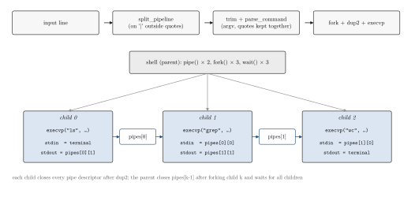
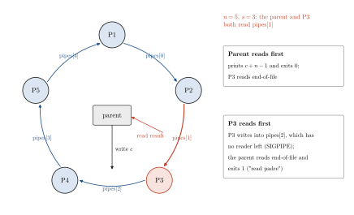

<div align="center">

# Processes and Pipes in C: a Message Ring and a Mini Shell

**Santiago Groba Alonso**

Universidad de San Andrés · *I304 Computer Architecture and Operating Systems* · First semester 2025 · Assignment 4

[](#reproducing-the-results)
[](#reproducing-the-results)

<picture>
  <source media="(prefers-color-scheme: dark)" srcset="docs/figures/trajectory-dark.svg">
  
</picture>

</div>

> **Abstract.** Two exercises on POSIX process management. The main one is an interactive shell that runs pipelines of any length (`ls | grep .zip | wc -l`) by creating one pipe per `|`, forking one child per command, rewiring its standard streams with `dup2` and replacing it with `execvp`; its parser keeps quoted arguments together, including quotes that contain spaces or `|`, which was the extra-credit part. On ten test pipelines of up to seven stages, the shell's output is identical to bash's. The warm-up exercise connects $n$ child processes in a ring of pipes and passes an integer around it, each process adding one. Running it 500 times per configuration shows that the parent and one child both hold the read end of the same pipe, so the outcome depends on scheduling: the parent prints $c+n-1$ in some runs and fails with a read error in the others. Both exercises come down to the same lesson: with pipes, the set of processes that keep each descriptor open defines the protocol.

---

## 1. Problem

**Exercise 1: ring.** `./ring <n> <c> <s>` creates $n$ child processes connected in a closed loop by pipes. The parent sends the integer $c$ to process $s$; each process reads the value from its predecessor, increments it and writes it to its successor, until the value returns to the parent, which prints it. With $n$ increments the expected output is $c + n$.

**Exercise 2: shell.** Given a line of programs separated by `|`, reproduce what bash does: each program's standard output feeds the next one's standard input. Commands without quotes are required (`ls | grep .zip`); handling quoted arguments (`ls | grep ".png .zip"`) is extra credit. Parsing in general is not the focus; process creation, descriptor management and waiting are.

## 2. Methods

<p align="center"></p>

**Figure 1.** How `src/ej2/shell.c` runs `ls | grep .zip | wc -l`: the line is split on `|` characters outside quotes, each command is tokenised into an `argv` array, and the parent creates two pipes and three children before waiting for all of them.

| Component | Choice |
|---|---|
| Shell loop | `fgets` into a 4 KiB buffer; prompt `Shell> ` only when stdin is a terminal (`isatty`), so scripts can be piped in; `exit` or end-of-file ends the shell |
| Syntax checks | A leading or trailing `\|` and empty commands between pipes are rejected with a message; an unterminated quote aborts that command |
| Splitting | `split_pipeline` tracks whether it is inside `'…'` or `"…"` and only splits on `\|` outside quotes |
| Tokenising | `parse_command` emits quoted strings as one argument without the quotes; at most 63 arguments per command |
| Execution | `command_count - 1` pipes created up front; child $k$ does `dup2(pipes[k-1][0], 0)` and `dup2(pipes[k][1], 1)`, closes every pipe descriptor and calls `execvp`; the parent closes each pipe once both of its ends have been handed to children and then calls `wait` once per child |
| Ring | `pipes[i]` connects child $i$ to child $i+1$ (mod $n$); each child closes the ends it does not use, reads once, increments, writes once and exits; the parent writes $c$ into `pipes[s-1]`, reads the result from `pipes[s-2]` and waits for the $n$ children |

## 3. Results

### 3.1 The shell

**Table 1.** Pipelines fed to `src/ej2/shell` on standard input and to bash, in a directory containing `a.zip`, `b.png`, `c.zip`, `d e.png` and `notes.txt`. Every output is byte-identical.

| Pipeline | Output (both shells) |
|---|---|
| `ls \| grep .zip` | `a.zip`, `c.zip` |
| `ls \| grep ".png"` | `b.png`, `d e.png` |
| `ls \| grep "e.png"` | `d e.png` |
| `ls \| grep ".png .zip"` | (no match) |
| `echo "a \| b" \| wc -c` | `6` |
| `echo 'single quoted' \| rev` | `detouq elgnis` |
| `echo hello world \| tr a-z A-Z` | `HELLO WORLD` |
| `seq 1 100 \| grep 7 \| wc -l` | `19` |
| `seq 1 1000 \| grep 1 \| grep 2 \| grep 3 \| sort -r \| head -5` | `321 312 231 213 132` |
| `seq 1 5 \| sort -r \| head -2 \| tail -1 \| cat \| cat \| cat` | `4` |

Malformed input is reported without crashing the shell: `| ls` and `ls |` print a syntax error near `|`, `ls | | wc -l` an empty-command error, an unterminated quote its own error, and an unknown program the `execvp` error while the rest of the pipeline still runs.

### 3.2 The ring

<p align="center"></p>

**Figure 2.** The topology `src/ej1/ring.c` builds for $n = 5$, $s = 3$. Child $i$ reads `pipes[i-1]` and writes `pipes[i]`. The parent injects $c$ into `pipes[s-1]`, which is read by P4 rather than P3, and collects from `pipes[s-2]`, which is also the input of P3. Whichever of the two reads first decides the outcome.

**Table 2.** Outcomes of 500 runs per configuration (Ryzen 5 5600, Linux 7.2, output captured by the calling shell). No run printed the expected $c + n$.

| $n$ | $c$ | $s$ | Expected $c+n$ | Printed $c+n-1$, exit 0 | `read padre` error, exit 1 |
|---:|---:|---:|---:|---:|---:|
| 3 | 0 | 1 | 3 | 65 (prints 2) | 435 |
| 5 | 10 | 3 | 15 | 71 (prints 14) | 429 |
| 10 | 0 | 1 | 10 | 147 (prints 9) | 353 |

The split is not stable: in an earlier batch with standard output sent to `/dev/null`, the first configuration printed 2 in 253 of 500 runs. The structure explains both outcomes. When the parent wins the race, the value has been incremented by $n-1$ children and P$s$ later reads end-of-file. When P$s$ wins, it increments and writes into `pipes[s-1]`, whose only reader has already exited, and the parent reads end-of-file. Making the parent read from a pipe that no child reads (for example, letting P$s$ write the final value to a dedicated pipe) would remove the race.

## 4. Takeaways

- A pipe is defined by who holds its ends: the shell works because every process closes the descriptors it does not use, so each reader sees end-of-file exactly when its writer exits.
- The ring shows the failure mode of the same rule: one extra holder of a read end turns a deterministic protocol into a race that only appears when the program is run many times.
- Creating all pipes before forking keeps the shell's descriptor bookkeeping in one loop, at the cost of each child inheriting, and having to close, every pipe in the pipeline.

## Reproducing the results

```bash
cd src/ej2 && make && ./shell               # interactive; `exit` or Ctrl-D to quit
printf '%s\n' 'seq 1 100 | grep 7 | wc -l' | ./shell     # non-interactive, no prompt

cd ../ej1 && make
./ring 5 10 3                                # <n> processes, initial value <c>, starting process <s>
for i in $(seq 500); do out=$(./ring 5 10 3 2>/dev/null); echo "$? $(echo "$out" | grep -o '[0-9]*$' | tail -1)"; done | sort | uniq -c

python docs/figures/make_figures.py          # Figures 1–2 (matplotlib)
```

| File | Content | Origin |
|---|---|---|
| `src/ej1/ring.c` | Ring of processes: argument parsing, pipes, children, parent | Santiago (on a 20-line course skeleton) |
| `src/ej2/shell.c` | Shell: quote-aware parsing, pipes, fork/exec, waiting | Santiago (on a 47-line course skeleton that only split on `\|`) |
| `src/ej*/Makefile` | Build | Course |
| `docs/figures/` | Figure script and style | This README |

## Acknowledgements

Assignment and skeleton code by the I304 teaching staff at UdeSA.

## Citation

```bibtex
@misc{groba2025shell,
  author       = {Groba Alonso, Santiago},
  title        = {Processes and Pipes in {C}: a Message Ring and a Mini Shell},
  year         = {2025},
  howpublished = {Universidad de San Andr{\'e}s, I304 Computer Architecture and Operating Systems},
  url          = {https://github.com/Santi2065/unix-shell-and-pipes}
}
```
